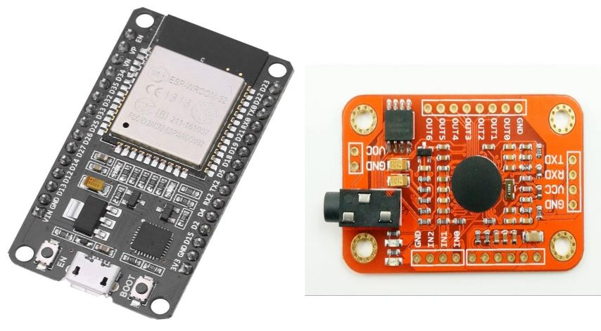

# ESP32 - Elechouse VR3
ESP32 Elechouse Voice Recognition Module V3 Support

This is a edit of the Elechouse Arduino library for their Voice Recognition Module V3, to work on an ESP32. To install, start by installing the Elechouse library from here:

[Github - Elechouse VR3 Library](https://github.com/elechouse/VoiceRecognitionV3)

And then overwrite 4 of the Elechouse files with the 4 files provided in my repo here. For full install details, including how to wire the ESP32 to the Elechouse VR3, see this blog posting:

[blog.frankvh.com - ESP32 Elechouse VR3 Support](https://blog.frankvh.com/2022/02/21/esp32-support-for-elechouse-voice-recognition-module-v3/)

I've been using this for my [Oscilloscope Voice Control project](https://www.frankvh.com/oscilloscope-voice-control-using-esp32/) - it works quite well.

